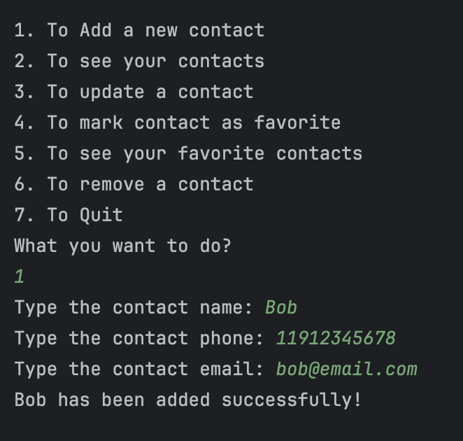
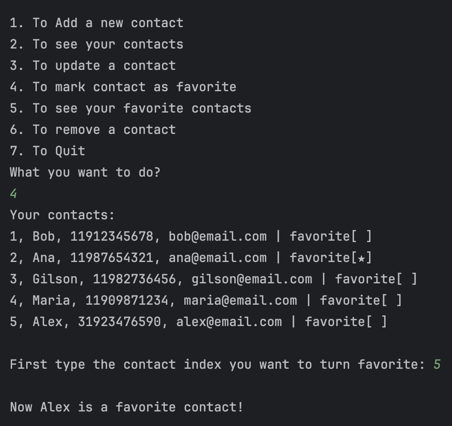
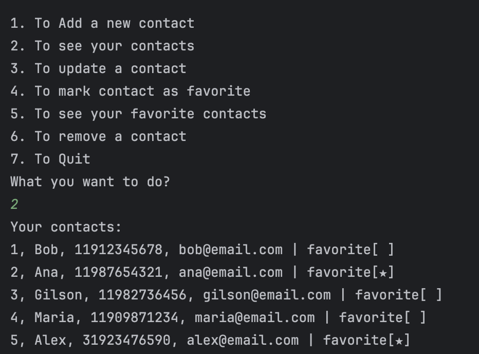
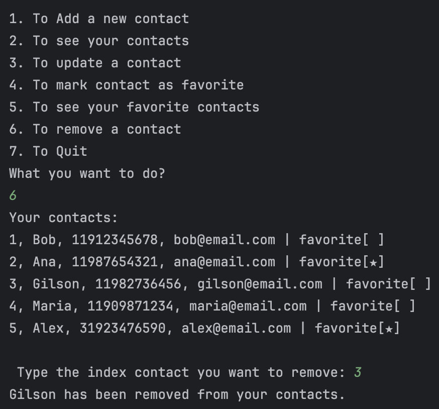

# Contact book

**Contact book** is a very symple program that allow you to manage your contacts list.

## Table of Contents

- [Features](#features)
- [Screenshots](#screenshots)
- [Installation](#installation)
- [Usage](#usage)
- [Technologies Used](#technologies-used)
- [Contributing](#contributing)
- [License](#license)

## Features

- **Add a contact**
- **Update a contact**
- **Read your contacts**
- **Read your favorite contacts**
- **Remove a contact**
- **Mark a contact as your favorite**
  
## Screenshots


<div display="flex">
  
  
  
  
</div>


## Installation

1. Clone the repository:
    ```bash
    git clone git@github.com:danilocucharro/contact-book.git
    ```
   
2. Navigate to the project directory:
    ```bash
    cd contact-book
    ```
   
3. Run the app:
    ```bash
    python3 agenda.py
    ```
   
5. Open the Expo app on your mobile device and scan the QR code to launch the app.

## Usage

1. Launch the **Contact book** app on your terminal.
2. Follow the menu to make the actions you want.
3. Create a new contact set the contact data (name, phone, email).
4. Manage your contact book.

## Technologies Used

- **Python**: For building the program.

## Contributing

1. Fork the project.
2. Create your feature branch:
    ```bash
    git checkout -b feature/your-feature-name
    ```
3. Commit your changes:
    ```bash
    git commit -m 'Add some feature'
    ```
4. Push to the branch:
    ```bash
    git push origin feature/your-feature-name
    ```
5. Open a pull request.
